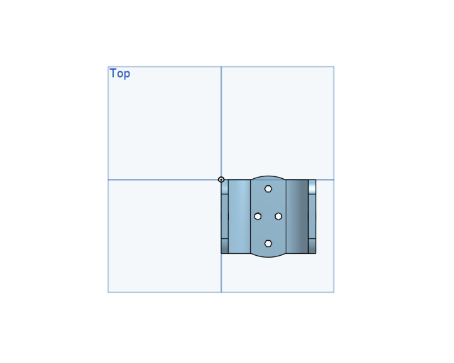

# 🤖 Robotic Arm Joint – CAD Project

## 📌 Overview
This project showcases a mechanical joint component designed as part of a robotic arm using Onshape. The joint serves as a pivot point between arm segments, enabling smooth and controlled movement essential in robotic mechanisms.

It was designed to be modular, lightweight, and compatible with standard servo motors, making it ideal for use in educational and automation-related robotic projects.

## 🧠 Key Features
- Component Type: Robotic Arm Joint (Rotational Hinge)
- Design Tool: Onshape CAD
- Material (Assumed): Plastic or Aluminum
- Mounting Holes: Includes circular and hexagonal holes for screw-based connections
- Design Style: Rounded edges for flexibility and symmetry
- Use Cases: Robotics, automation arms, mechanical joints

## 🛠️ Tools Used
- ✅ Onshape (for 3D CAD modeling)
- ✅ Browser-based design and cloud sharing

## 🖼️ Screenshots

### 🔧 Model Preview (Top View)

### ⚙️ Perspective View

### 🌐 View the 3D Model
You can interact with the model directly on Onshape via the link below:

🔗 [View Onshape Model](https://cad.onshape.com/documents/aeed051e96dde7a425eaec78/w/aeffb5480c87a7251e3be776/e/309f94e4fb198937cd406044)
### 📁 STL File
[Download STL Export](https://github.com/JawaherMQ5/RoboJoint/blob/main/Part%20Studio%201%20-%20Part%201.stl) - 3D printable version of the joint.
## 📁 Files
You can find the CAD files and model screenshots in this repository:
